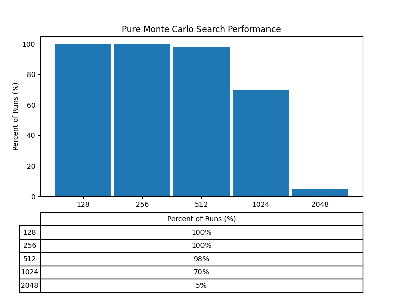
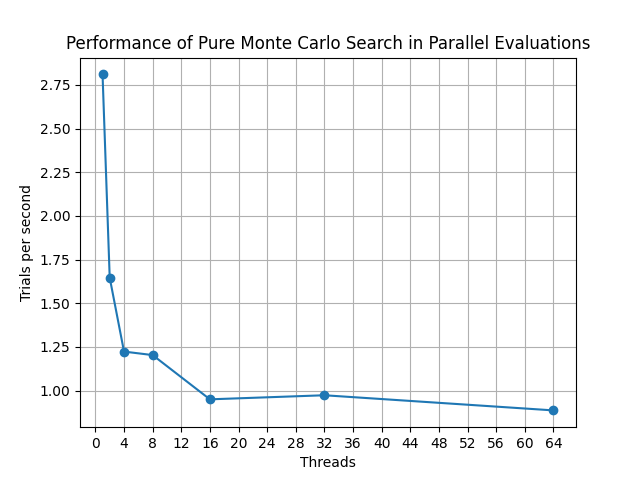

# 2048
The only thing that kept me sane during a recent international flight was the
game 2048. As I mindlessly played, chasing the elusive 4096 tile, I realized I
could probably write a program to solve it. That idea evolved, and I decided
it would be a fun challenge to clone the game myself.

Along the way, I gained experience with React, learned how to create smooth
animations and styling using Tailwind, and even ventured into the world of
WebAssembly. I also implemented a simple “AI” solver using the Pure Monte Carlo
algorithm to choose the next best move.

Eventually, I plan to add a few more AI models and compare their performance,
along with introducing some additional power-ups. But for now, feel free to
check out a working version [here](https://rmejia4209.github.io/2048/)!
> [Inspired by the original 2048]()
# Tech Stack

    

    

    

    

    

    

    

  

# WASM vs Native JavaScript Performance
Initially, I implemented the Pure Monte Carlo Search algorithm in TypeScript,
but the performance was abysmal—it took around 200ms to determine the next
move.

I’ve always wanted to try WebAssembly, partly because of my interest in C and
low-level programming and partly hoping for a speed boost. I rewrote the
core game logic in C. Instead of using a 4x4 matrix, I represented the board
as a 64-bit integer, with each nibble storing the tile’s exponent. Bitwise
operations are then used to update the board—an approach inspired by users on
Stack Exchange. While the number of computations per iteration remains the
same (16 cells to process), memory loading and game state comparisons are
theoretically faster. Below is a table comparing the speed of my original
TypeScript implementation versus the WASM version. An 80% improvement in
performance isn't too shabby if you ask me.

|Implementation       | Average Time Per Move (ms)|
|:--------------------|:-------------------------:|
|TypeScript           |             90            |
|WASM                 |             27            |
|WASM compiled with O1|             20.7          |
|WASM compiled with O2|             18.0          |
|WASM compiled with O3|             17.7          |

> From what I understand, WASM isn’t inherently faster than JavaScript’s
> runtime, but it tends to offer more consistent performance. I probably could
> have optimized the TypeScript implementation, but I was more curious to try
> out WebAssembly.

# Model Comparison
## Pure Monte Carlo Search
The Pure Monte Carlo Search compares the average score from several simulations
of all available moves. Each simulation plays out the game using random moves
until it ends or a predefined depth is reached. While the algorithm itself
isn’t considered machine learning or AI, it’s a simplified version of a
foundational search technique often used within more advanced systems—such as
in AlphaGo—to support decision-making.
### Performance
Overall, the model is rather limited only reaching the 2048 tile 5% of the time.

    

# Parallel Computing
One of my favorite classes was parallel computing, and benchmarking the Pure
Monte Carlo Search algorithm felt like a great opportunity to apply some of
what I learned. The graph below shows performance versus the number of threads
used. While the server I ran this on isn’t top-tier hardware, the data clearly
shows a performance boost from increased parallelism.

    
